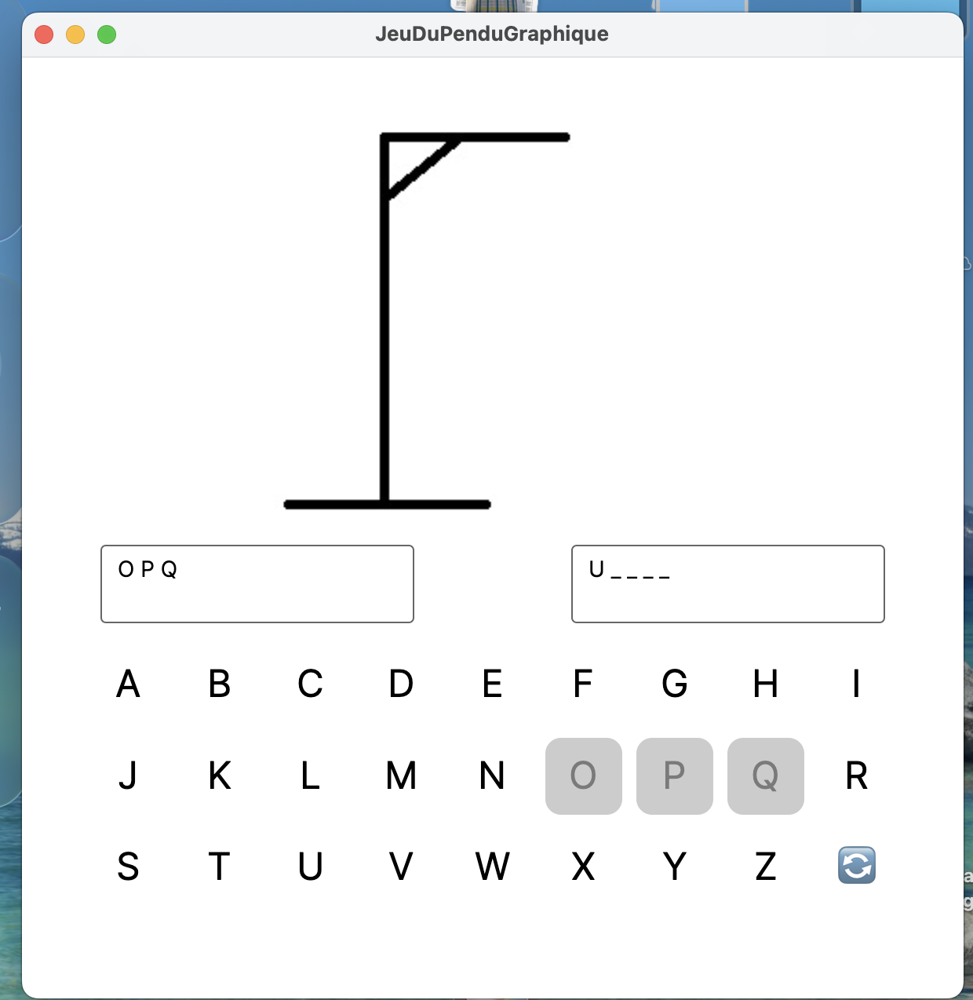

# Jeu du Pendu – Projet C# Avalonia

## Ce projet est une application graphique représentant le célèbre jeu du Pendu, développée en C# avec le framework Avalonia UI.





### Il s’agit d’un exercice complet qui combine :

- Gestion d’interface graphique (UI),

- Logique de jeu,

- Manipulation de collections,

- Gestion d’événements,

- Interaction avec des images,

- Aléatoire et contrôle de flux,

- Bonne structuration du code.

## Fonctionnalités
**Tirage aléatoire d’un mot**

***Un mot est sélectionné aléatoirement dans une liste prédéfinie.***

*Le mot est affiché sous forme de lettres masquées (_ _ _ _).*

#### *Clavier virtuel*

- Un clavier A → Z s’affiche sous la zone de jeu.

- Lorsqu’une lettre est cliquée :

- Le bouton se désactive automatiquement.

- La lettre est ajoutée à la liste des lettres tapées.

- Vérification des lettres

- Si la lettre est correcte → les positions correspondantes sont révélées.

- Si la lettre est incorrecte → une nouvelle étape du pendu s’affiche.

#### *Affichage progressif du pendu*

- 10 images : de pendu1.png à pendu10.png.

- À la dernière image, la partie est perdue.

#### *Gestion victoire / défaite*

- Victoire : toutes les lettres sont trouvées.

- Défaite : l’image finale (pendu10) est atteinte.

- Dans les deux cas :

    - Le clavier est désactivé,

    - Un message affiche le résultat.

#### *Rejouer*

Un bouton permet de :

- Réinitialiser l’affichage,

- Tirer un nouveau mot,

- Réactiver le clavier,

- Revenir à l’image du pendu initiale.

#### *Technologies utilisées*

- Langage : C#

- Framework UI : Avalonia 11.x

#### *Paradigmes* :

- Événements (Click)

- Programmation orientée objet

- Gestion de listes et tableaux

- Manipulation de chaînes

- Randomisation

- IDE : Visual Studio, Rider, VS Code ou autre

### Contenu du projet

- JeuDuPenduGraphique/
    - assets/
        - pendu0.png
        - pendu1.png
        - ...
        - pendu10.png

    - MainWindow.axaml
    - MainWindow.axaml.cs
    - App.axaml
    - App.axaml.cs
    - Program.cs
    - README.md

### Installation & Exécution

1) Cloner le projet :
```bash 
git clone https://github.com/<NDR-2004>/JeuDuPenduGraphique.git
```

2) Ouvrir le projet dans Visual Studio / Rider / VS Code.

3) Restaurer les dépendances :
```bash
dotnet restore
````

4) Lancer l'application :
```bash
dotnet run
```


## Objectifs pédagogiques

#### Ce projet m’a permis de :

- Manipuler Avalonia UI (XAML, styles, composants)

- M’entraîner sur la gestion des événements

- Travailler avec les listes, tableaux, chars et strings

- Comprendre la logique d’un jeu simple

- Gérer proprement les états (victoire, défaite)

- Apprendre à structurer une petite application C#

#### Améliorations futures :

- Ajouter différents niveaux de difficulté

- Ajouter un mode “dictionnaire complet”

- Ajouter un score ou un nombre de parties gagnées

- Ajouter des animations

- Ajouter un thème clair/sombre

### Licence

*Ce projet est libre d’utilisation et modifiable.
Tu peux en faire ce que tu veux 🙂*

### Auteur

Développé par Nahem Rigaldies
Étudiant en informatique – BTS SIO SISR
Passionné de développement, réseaux, IA et Spatial.


